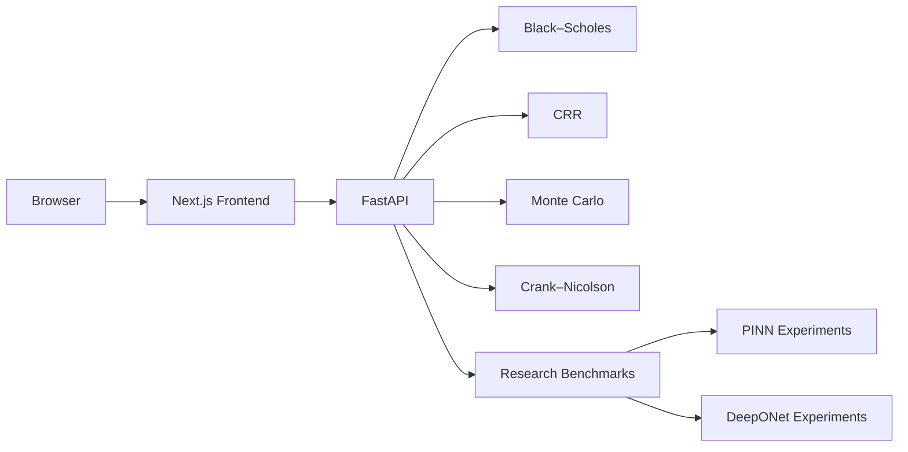

# QuantLab

> An interactive computational-finance laboratory for comparing analytical, numerical, scientific-ML and operator-learning methods for derivative pricing.

QuantLab combines a Python/FastAPI numerical backend with a Next.js research interface.

## Live application

Frontend:
https://YOUR-VERCEL-DOMAIN

API:
https://quantlab-production-38f0.up.railway.app

API docs:
https://quantlab-production-38f0.up.railway.app/docs

---
Frontend:

```bash
cd frontend
npm run lint
npm run build
```

---

## Numerical implementation note

The Crank–Nicolson solvers use tridiagonal linear-system
solves rather than generic dense `numpy.linalg.solve` calls.

This preserves the finite-difference formulation while
reducing computational cost and improving deployment
performance on constrained cloud runtimes.

It is designed around one question:

> **When should we prefer closed-form methods, classical numerical solvers, physics-informed neural networks, or learned solution operators?**

---

## Core methods

### Analytical
- Black–Scholes

### Classical numerical methods
- Cox–Ross–Rubinstein binomial trees
- Monte Carlo simulation
- Crank–Nicolson finite differences
- Projected Crank–Nicolson for American options

### Scientific machine learning
- European Black–Scholes PINN
- American PINN V1 — obstacle penalty
- American PINN V2 — complementarity / Fischer–Burmeister formulation

### Operator learning
- European DeepONet
- American DeepONet

---

## Research findings

For the current American-put benchmark:

- Projected Crank–Nicolson remains the strongest classical approximation.
- PINN V2 substantially improves over the simpler obstacle-penalty PINN.
- DeepONet introduces larger approximation error than the classical solver, but offers extremely low repeated-query inference cost after training.
- The current amortisation experiment estimates a break-even point of roughly **2,264 repeated pricing queries**.

These figures are experimental results from the current implementation and benchmark configuration rather than universal performance claims.

---

## Application structure

```text
quantlab/
├── backend/
│   ├── app/
│   │   ├── api/
│   │   ├── models/
│   │   └── schemas/
│   ├── experiments/
│   ├── tests/
│   └── requirements.txt
│
├── frontend/
│   ├── app/
│   ├── components/
│   ├── lib/
│   └── public/research/
│
└── README.md
```

---

## Architecture



---

## Pricing Lab

The main application provides interactive comparison of:

- Black–Scholes
- CRR binomial pricing
- Crank–Nicolson
- Monte Carlo

It also exposes:

- pricing error
- runtime
- Monte Carlo confidence intervals
- Delta
- Gamma
- Vega
- Theta
- Rho
- spot sensitivity
- numerical convergence

---

## Research Lab

The dedicated Research Lab compares:

### American option solvers
- CRR benchmark
- Projected Crank–Nicolson
- PINN V1
- PINN V2

### Operator learning
- DeepONet generalisation error
- inference latency
- online speedup
- offline training cost
- break-even query count

The interface also displays experiment-generated figures for training convergence, pricing surfaces and approximation error.

---

## Benchmark snapshot

Current American-put results include approximately:

| Method | MAE vs CRR |
|---|---:|
| Projected CN | 0.00139 |
| PINN V1 | 0.57790 |
| PINN V2 | 0.12401 |

American DeepONet test performance:

| Metric | Value |
|---|---:|
| MAE | 0.19912 |
| RMSE | 0.25973 |
| Median error | 0.16166 |
| 95th-percentile error | 0.53832 |
| Maximum error | 1.23268 |

Current operator-learning benchmark:

| Metric | Value |
|---|---:|
| Projected CN/query | ~0.0151 s |
| DeepONet/query | ~6.58e-7 s |
| Measured batched speedup | ~22,933× |
| Estimated break-even | ~2,264 queries |

The latency comparison uses batched DeepONet inference and should be interpreted as an experimental throughput benchmark rather than single-request production latency.

---

## Backend

Create the environment:

```bash
python3 -m venv .venv
source .venv/bin/activate
```

Install:

```bash
pip install -r backend/requirements.txt
```

Run tests:

```bash
cd backend
PYTHONPATH=. pytest -v
```

Current test suite:

```text
22 passed
```

Start FastAPI:

```bash
PYTHONPATH=. uvicorn app.main:app --reload
```

API:

```text
http://127.0.0.1:8000
```

Swagger:

```text
http://127.0.0.1:8000/docs
```

---

## Frontend

```bash
cd frontend
npm install
```

Create:

```text
.env.local
```

with:

```env
NEXT_PUBLIC_API_URL=http://127.0.0.1:8000
```

Start:

```bash
npm run dev
```

Open:

```text
http://localhost:3000
```

Research Lab:

```text
http://localhost:3000/research-lab
```

---

## Production checks

Backend:

```bash
cd backend
PYTHONPATH=. pytest -v
```

## Research direction

The next research questions are not about adding more pricing formulas.

They include:

- more rigorous DeepONet latency benchmarking
- optimized tridiagonal finite-difference solvers
- repeated-trial statistical benchmarking
- checkpointed neural inference
- early-exercise-boundary analysis
- parameter-distribution shift
- extrapolation outside training ranges
- uncertainty estimation for learned operators
- comparison using real option-market data

---

## Author

**Rancy Chepchirchir**

AI · Data Science · Quantitative Finance